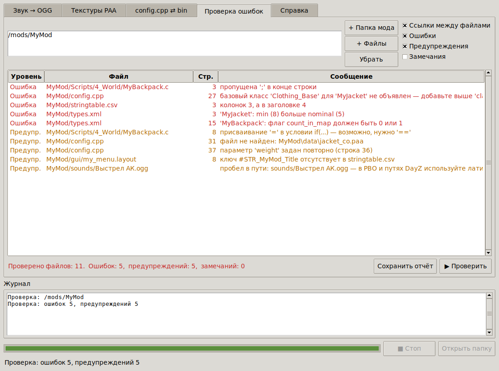
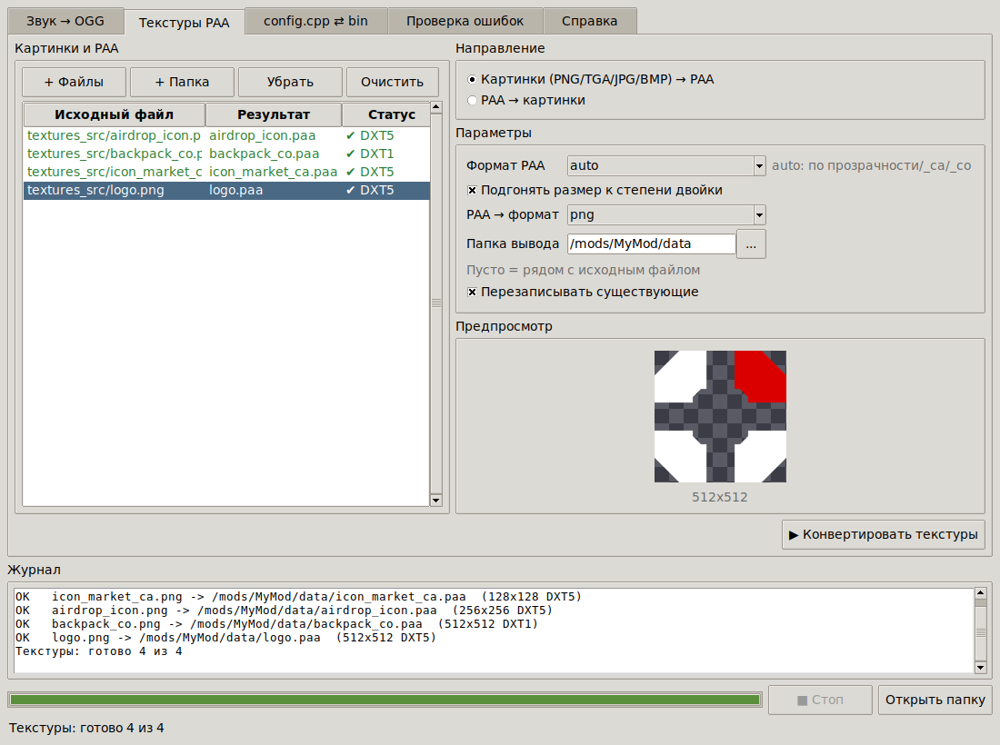
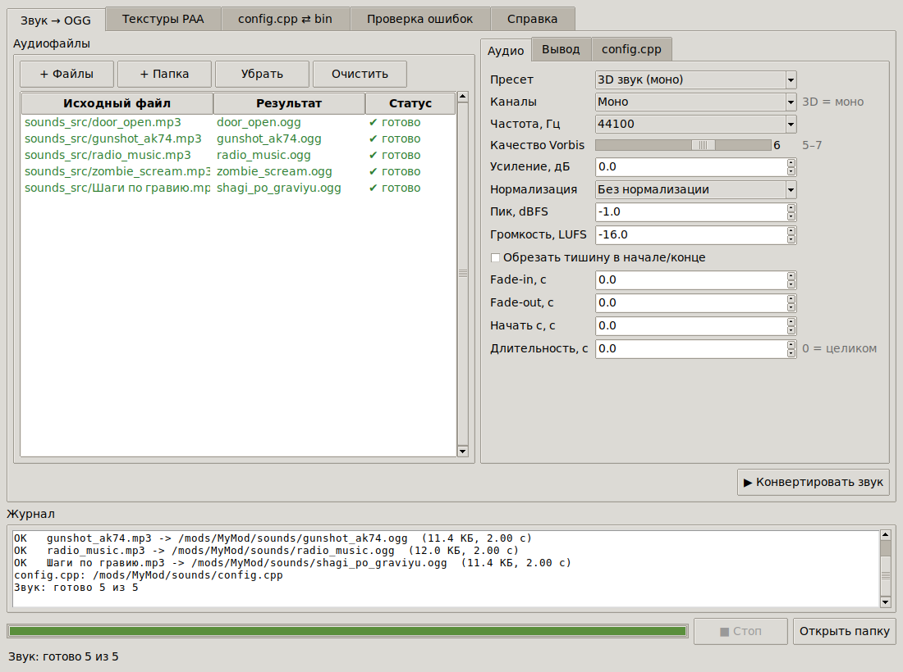
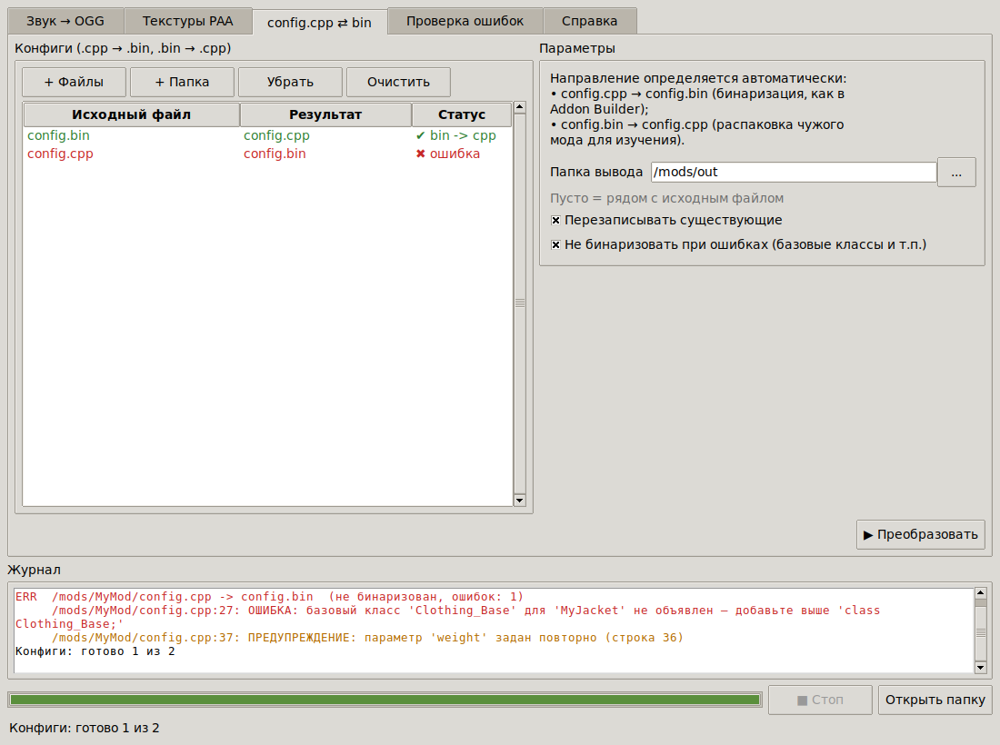

# DayZ Mod Toolkit

Набор инструментов для моддера DayZ в одной программе: конвертирует нужные игре форматы
и проверяет мод на ошибки до того, как вы соберёте PBO и запустите сервер.

| Вкладка | Что делает |
|---|---|
| **Звук → OGG** | MP3/WAV/FLAC/M4A/AAC/WMA/OPUS → OGG Vorbis + генерация `CfgSoundShaders`/`CfgSoundSets` |
| **Текстуры PAA** | PNG/TGA/JPG/BMP → PAA (DXT1/DXT5 с mip-уровнями) и PAA → PNG/TGA, предпросмотр PAA |
| **config.cpp ⇄ bin** | бинаризация `config.cpp` → `config.bin` с проверкой ошибок и распаковка `config.bin` → `config.cpp` |
| **Проверка ошибок** | синтаксис и смысловые ошибки во всех файлах мода, ссылки между файлами |



<details><summary>Остальные вкладки</summary>





</details>

## Готовая программа

`DayZModToolkit.exe` — один файл для Windows 10/11. Python и ffmpeg уже встроены, устанавливать ничего не нужно.

Скачать можно в разделе **Releases** репозитория (релиз `dayz-toolkit-latest`) или на вкладке **Actions** → «DayZ Mod Toolkit (Windows exe)» → артефакт.
Программа пересобирается автоматически на Windows после каждого изменения в `DayZ_ModToolkit/`.
Перед публикацией сборка проходит автотесты и проверку всех режимов уже готового `.exe`.

Файлы и папки можно перетаскивать прямо на `.exe`: программа сама откроет нужную вкладку.
Если Windows SmartScreen предупредит о неизвестном издателе, нажмите «Подробнее» → «Выполнить в любом случае».

## Проверка ошибок

Укажите папку мода (ту, где лежит `config.cpp` или `config.bin`) и нажмите «Проверить».
Двойной щелчок по строке открывает файл, в VS Code — сразу на нужной строке.

| Файлы | Что проверяется |
|---|---|
| `config.cpp` | синтаксис с номером строки и столбца: пропущенные `;` и `};`, незакрытые строки и скобки, массивы без `[]`, пропущенные запятые; **необъявленные базовые классы** (`class X: Inventory_Base` без `class Inventory_Base;`); повторные классы и параметры; `CfgPatches` (units/weapons/requiredAddons); `#include`/`#define`/`#ifdef` |
| `config.bin` | целостность бинарного конфига |
| скрипты `.c` | незакрытые строки и комментарии; несбалансированные `()[]{}` с указанием, где открыта парная скобка; пропущенная `;`; пропущенная `,` в `enum`; `if (...);` с пустым телом; `=` вместо `==` в условии; `#ifdef`/`#endif`; повторное объявление класса |
| `.layout`, `.imageset`, `.styles` | скобки и строки |
| XML | корректность XML; для **types.xml**: `min > nominal`, `quantmin`/`quantmax`, нечисловые значения, флаги 0/1, повторы типов; также events.xml, cfgspawnabletypes.xml (chance 0..1), globals.xml |
| JSON | синтаксис (лишние запятые, комментарии, кавычки), повторяющиеся ключи |
| `stringtable.csv` | UTF-8, заголовок `Language`, число колонок, пустые и повторяющиеся ключи, ошибки в кавычках |
| `.paa` | структура, размеры (степень двойки), цепочка mip-уровней, суффиксы `_co`/`_ca` |
| `.ogg` | действительно ли это OGG, кодек Vorbis, частота |
| весь мод | **ссылки на несуществующие файлы** (`.paa`, `.edds`, `.layout`, `.ogg`, `.rvmat`, `.p3d` …) из скриптов, конфигов, layout и XML; звуки в `samples[]`; папки скриптов в `CfgMods`; ключи `#STR_…` без перевода в stringtable; пробелы и кириллица в именах файлов |

Проверка скриптов — это быстрый анализатор, а не компилятор DayZ. Он ловит типичные синтаксические ошибки,
из-за которых игра не запускается, но не проверяет типы и существование методов.

Префикс мода берётся из `$PBOPREFIX$`, `_PBO_PROPERTIES.txt` или имени папки. Пути к ванильной игре
(`dz\…`, `gui\…`) и к другим модам не проверяются.

## Текстуры

- Стороны текстуры должны быть степенью двойки (256, 512, 1024, 2048 …). Можно включить автоподгонку размера.
- Формат `auto`: если есть прозрачность или суффикс `_ca`, `_nohq`, `_smdi`, `_as`, то DXT5; для `_co` и картинок без прозрачности — DXT1
  (при 1-битной прозрачности DXT1 тоже её сохраняет).
- Mip-уровни генерируются до 4×4, как у ImageToPAA.

## Консольный режим

```bat
DayZModToolkit.exe --cli audio    "D:\sounds" -o "P:\MyMod\sounds" --config --mod MyMod
DayZModToolkit.exe --cli paa      "D:\textures" --format auto --resize
DayZModToolkit.exe --cli png      "P:\MyMod\data" -o "D:\edit"
DayZModToolkit.exe --cli rapify   "P:\MyMod\config.cpp"
DayZModToolkit.exe --cli derapify "D:\other_mod\config.bin" -o "D:\study"
DayZModToolkit.exe --cli check    "P:\MyMod" --report report.txt
```

`--cli <подкоманда> --help` выводит все параметры. `check` возвращает код 1, если найдены ошибки,
поэтому проверку удобно встроить в свой скрипт сборки. Старый вызов `--cli <аудиофайлы>` по-прежнему конвертирует звук.

## Звук: советы для DayZ

- **Моно** нужно для всех 3D-звуков в мире, стерео — только для 2D (UI, музыка в меню).
- 44100 Гц, качество Vorbis 5–7.
- Короткие эффекты нормализуйте по пику (−1…−2 dBFS), музыку и эмбиент — по громкости (−16…−20 LUFS).
- Для зацикленных звуков не используйте fade, иначе в месте склейки будет «провал».

Подключение звука в скрипте:

```c
EffectSound snd = SEffectManager.PlaySound("MyMod_shot_SoundSet", GetPosition());
snd.SetSoundAutodestroy(true);
```

## Запуск из исходников

```bat
pip install -r requirements.txt
python dayz_toolkit.py
```

Для звука нужен ffmpeg: положите `ffmpeg.exe` рядом со скриптом, добавьте его в PATH или установите пакет `imageio-ffmpeg`.
Собрать свой `.exe` можно через `build_exe.bat`. Автотесты запускаются командой `python -m pytest tests`.

Структура:

```
dayz_toolkit.py      точка входа
dztk/audio.py        звук -> OGG, генерация CfgSoundShaders/CfgSoundSets
dztk/paa.py          чтение/запись PAA (DXT1/DXT5), dztk/lzo.py — распаковка LZO
dztk/cfg.py          препроцессор, парсер и проверки config.cpp
dztk/rap.py          config.bin <-> config.cpp
dztk/enforce.py      проверка скриптов Enforce Script
dztk/checks.py       проверки всех типов файлов и ссылок внутри мода
dztk/cli.py, gui.py  консольный и графический интерфейс
tests/               автотесты (используют мод SM_PartyMod из репозитория)
```
