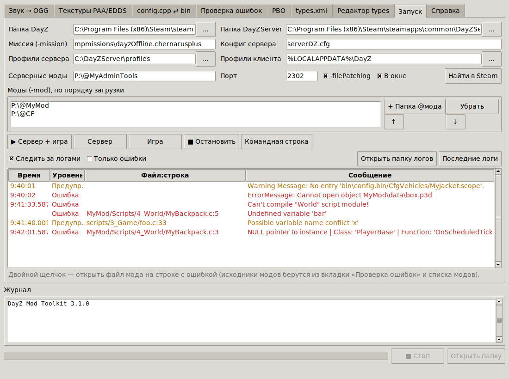
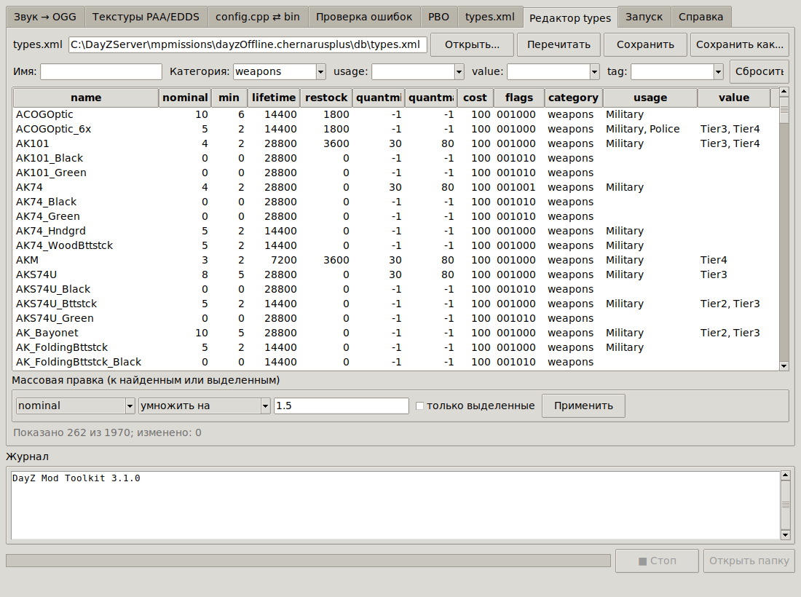
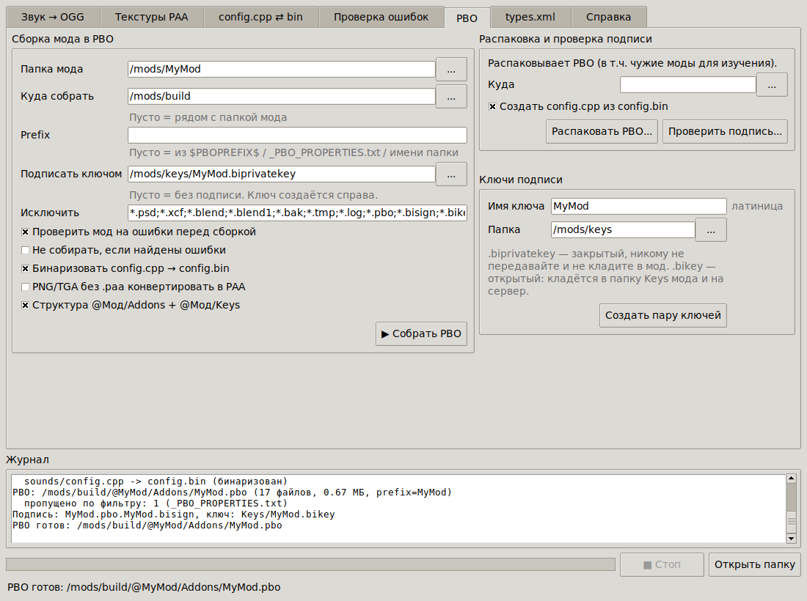
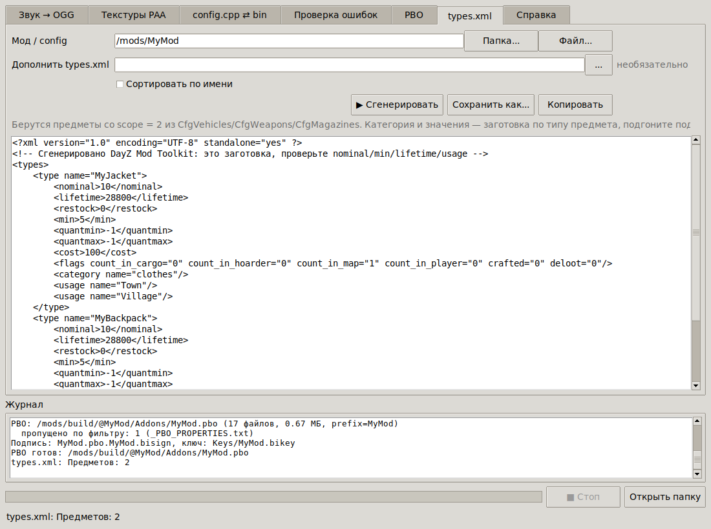
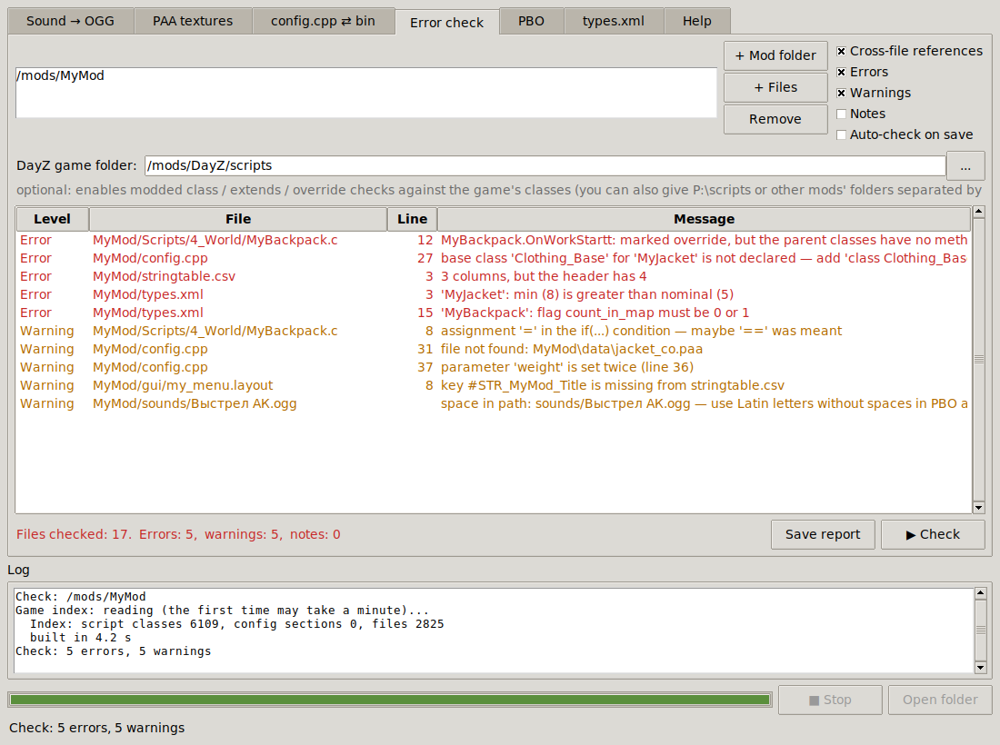
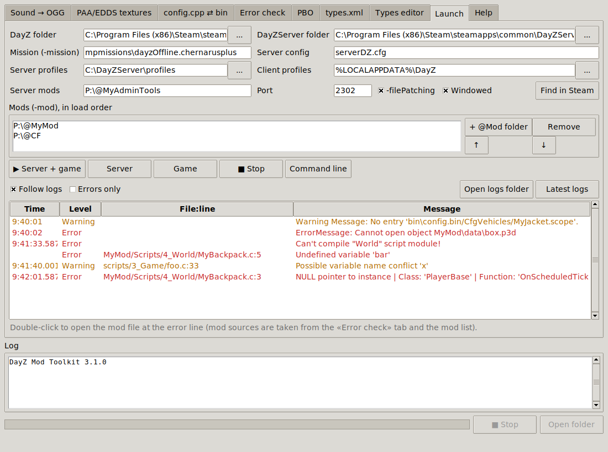

# DayZ Mod Toolkit

[English below](#english)

Набор инструментов для моддера DayZ в одной программе: конвертирует нужные игре форматы,
собирает и подписывает PBO, проверяет мод и папку миссии на ошибки (и исправляет типовые), запускает игру
с сервером и показывает ошибки из логов. Интерфейс на русском и английском.


<details><summary>Остальные вкладки</summary>







</details>

| Вкладка | Что делает |
|---|---|
| **Звук → OGG** | MP3/WAV/FLAC/M4A/AAC/WMA/OPUS → OGG Vorbis + генерация `CfgSoundShaders`/`CfgSoundSets` |
| **Текстуры PAA/EDDS** | PNG/TGA/JPG/BMP → PAA (DXT1/DXT5, mip-уровни, сжатие LZO) или EDDS (LZ4) и обратно, предпросмотр, **атлас иконок** (одна текстура + `.imageset`) |
| **config.cpp ⇄ bin** | бинаризация `config.cpp` → `config.bin` с проверкой и распаковка `config.bin` → `config.cpp` |
| **Проверка ошибок** | синтаксис и смысловые ошибки во всех файлах мода, ссылки между файлами (в т.ч. из `.p3d` и `.rvmat`), `requiredAddons`, папка миссии сервера, проверка по классам игры, автопроверка при сохранении, **автоисправление** |
| **PBO** | сборка мода в PBO (проверка → бинаризация → упаковка → подпись), распаковка, проверка подписи, создание ключей |
| **types.xml** | заготовки `<type>` для всех предметов мода, дополнение существующего `types.xml`, сортировка |
| **Редактор types** | `types.xml` таблицей: фильтры, правка ячеек, массовые операции; меняются только изменённые значения |
| **Запуск** | DayZ Server + игра с вашими модами (`-mod`, `-filePatching`), ошибки из `script*.log`/`crash*.log`/`*.RPT` в реальном времени |

## Готовая программа

`DayZModToolkit.exe` — один файл для Windows 10/11. Python и ffmpeg уже встроены, устанавливать ничего не нужно.

Скачать можно в разделе **Releases** репозитория (релиз `dayz-toolkit-latest`) или на вкладке **Actions** → «DayZ Mod Toolkit (Windows exe)» → артефакт.
Программа пересобирается автоматически после каждого изменения в `DayZ_ModToolkit/`.
Перед публикацией сборка проходит автотесты и проверку всех режимов уже готового `.exe` на Windows.

Файлы и папки можно перетаскивать прямо на `.exe`: программа сама откроет нужную вкладку.
Если Windows SmartScreen предупредит о неизвестном издателе, нажмите «Подробнее» → «Выполнить в любом случае».
Язык интерфейса выбирается автоматически по языку Windows, переключается на вкладке «Справка».

## Проверка ошибок

Укажите папку мода (ту, где лежит `config.cpp` или `config.bin`) и нажмите «Проверить».
Двойной щелчок по строке открывает файл, в VS Code — сразу на нужной строке.
Режим «Автопроверка при сохранении» перепроверяет мод каждый раз, когда вы сохраняете файл.

| Файлы | Что проверяется |
|---|---|
| `config.cpp` | синтаксис с номером строки и столбца: пропущенные `;` и `};`, незакрытые строки и скобки, массивы без `[]`, пропущенные запятые; **необъявленные базовые классы**; повторные классы и параметры; `CfgPatches`; `#include`/`#define`/`#ifdef` |
| скрипты `.c` | незакрытые строки и комментарии; несбалансированные `()[]{}` с указанием, где открыта парная скобка; `#ifdef`/`#endif`; `if (...);` с пустым телом; `=` вместо `==` в условии; повторное объявление класса |
| `.layout`, `.imageset`, `.styles` | скобки и строки |
| XML | корректность XML; **types.xml**: `min > nominal`, `quantmin`/`quantmax`, нечисловые значения, флаги 0/1, повторы; events.xml, cfgspawnabletypes.xml, globals.xml |
| JSON, `stringtable.csv`, `.paa`, `.ogg`, `config.bin` | синтаксис, кодировка, колонки и ключи, размеры и mip-уровни, кодек Vorbis, целостность |
| `.rvmat`, `.p3d`, `.edds` | синтаксис материала и его текстуры; текстуры и материалы модели (MLOD полностью, у ODOL — найденные пути); целостность EDDS |
| весь мод | **ссылки на несуществующие файлы** (`.paa`, `.edds`, `.layout`, `.ogg`, `.rvmat`, `.p3d` …); звуки в `samples[]`; папки скриптов в `CfgMods`; ключи `#STR_…`/`$STR_…` без перевода и неиспользуемые ключи; `requiredAddons` (аддон в своих же зависимостях, циклы, с папкой игры — опечатки); пробелы и кириллица в именах файлов |
| папка миссии | `category`/`usage`/`value`/`tag` из types.xml объявлены в `cfglimitsdefinition(user).xml`; файлы и папки из `cfgeconomycore.xml`; один тип в нескольких файлах; дочерние типы событий; группы `cfgeventspawns` ↔ `cfgeventgroups`; пресеты `cfgspawnabletypes` ↔ `cfgrandompresets`; файлы из `cfggameplay.json`. Официальные миссии Bohemia проходят без ошибок |

### Автоисправление

Кнопка «Исправить...» (или `--cli fix`) показывает план и применяет выбранные исправления:
`class X;` перед классом с необъявленным родителем, пропущенная `;` после `}` класса,
заготовки для отсутствующих ключей в `stringtable.csv`, недостающие колонки,
переименование файлов с пробелами/кириллицей с исправлением всех ссылок в конфигах, скриптах, layout, xml и json.
Перед изменением файлы копируются в папку `<мод>_backup_<дата>` рядом с модом.

### Проверка по классам игры

Если в поле «Папка игры DayZ» указать папку установки игры (программа читает `dta\*.pbo` и `Addons\*.pbo`
прямо из архивов), распакованные скрипты (`P:\scripts`) или папки модов-зависимостей, дополнительно проверяется:

- `modded class X`: класс `X` существует в игре или в моде;
- `class A extends B`: класс `B` существует;
- `override`: у родительских классов действительно есть такой метод. Это ловит опечатки
  и методы, удалённые в новой версии игры: из-за них скрипты перестают компилироваться;
- внешние классы в `config.cpp` (`class Clothing_Base;`) есть в конфигах игры.

Индекс строится один раз и кэшируется. Отсутствие ложных ошибок проверено на всех 2825 скриптах
DayZ ([DayZ-Script-Diff](https://github.com/BohemiaInteractive/DayZ-Script-Diff)).

Проверка скриптов — быстрый анализатор, а не компилятор DayZ. Пропущенная `;` в конце строки показывается
только как замечание: компилятор DayZ это прощает, в самой игре таких мест десятки.

## PBO и подписи

- **Сборка**: проверка ошибок → бинаризация `config.cpp` (с `#include`) → упаковка → подпись.
  Результат раскладывается по структуре `@Мод/Addons/Мод.pbo` + `@Мод/Keys/ключ.bikey`.
  Prefix берётся из `$PBOPREFIX$`, `_PBO_PROPERTIES.txt` или имени папки. Исходники (`*.psd`, `.git` …)
  исключаются по маскам, а `.biprivatekey` не попадает в PBO никогда.
  По желанию PNG/TGA без парного `.paa` конвертируются в PAA прямо при сборке.
- **Ключи**: создание `.biprivatekey` (закрытый, никому не передавать) и `.bikey` (кладётся в `Keys` и на сервер).
- **Подпись** `.bisign` v3 и её проверка. Формат совпадает с DSSignFile: подпись эталонного PBO
  совпадает байт в байт с эталонной подписью из тестов [HEMTT](https://github.com/BrettMayson/HEMTT).
- **Распаковка** любых PBO (включая старые со сжатием LZSS) с автоматическим `config.cpp` из `config.bin`.

Формат записи проверен на эталонах: из тех же файлов, в том же порядке и с теми же свойствами получаются PBO,
байт в байт совпадающие с PBO от Mikero и HEMTT.
Модели `.p3d` и `.rvmat` программа не бинаризует: они кладутся в PBO как есть.

## types.xml

Для всех классов со `scope = 2` из `CfgVehicles`, `CfgWeapons`, `CfgMagazines` создаются заготовки `<type>`.
Категория (`weapons`, `clothes`, `food`, `tools`, `containers`, `explosives`) и стартовые значения подбираются
по имени класса и его родителям. Можно дополнить существующий `types.xml` только недостающими типами и отсортировать его.
Значения — отправная точка: подгоните `nominal`/`min`/`lifetime`/`usage` под свой сервер.

## Редактор types.xml

Откройте `types.xml` миссии: фильтры по имени (`AK*`), категории, usage, value, tag; двойной щелчок по ячейке — правка
(`flags` — 6 цифр, списки через запятую, `@имя` — user-набор); массовые операции над найденными или выделенными
строками: установить, умножить, прибавить, добавить или убрать usage/value/tag. При сохранении меняются только
затронутые значения — комментарии, закомментированные типы и оформление файла остаются как были.

## Запуск и логи

Вкладка «Запуск» находит DayZ и DayZServer в библиотеках Steam, запускает сервер с вашими модами, а через 10 секунд —
игру с подключением к нему (`-connect=127.0.0.1`). С `-filePatching` запускается `DayZ_x64.exe` без BattlEye.
Пока игра работает, новые ошибки из `script*.log`, `crash*.log` и `*.RPT` появляются в таблице;
повторяющиеся ошибки схлопываются в одну строку. Двойной щелчок открывает файл мода на строке из ошибки
или из стека вызовов.

## Обновления

Раз в день при запуске программа проверяет, не вышла ли новая версия (GitHub Releases), и предлагает открыть страницу
загрузки. Проверку можно отключить или запустить вручную на вкладке «Справка». Сама программа ничего не скачивает.

## Текстуры

- Стороны текстуры должны быть степенью двойки (256, 512, 1024 …). Можно включить автоподгонку размера.
- Формат `auto`: прозрачность или суффиксы `_ca`, `_nohq`, `_smdi`, `_as` → DXT5; `_co` и картинки без прозрачности → DXT1.
- Mip-уровни до 4×4, крупные уровни сжимаются LZO, как у ImageToPAA, — размер файлов почти такой же.
- EDDS (текстуры Enfusion): DXT1/DXT5 с полной цепочкой mip-уровней и сжатием LZ4; читаются также BC7 и BGRA/BGRX.
- Атлас иконок: картинки раскладываются на одну текстуру (стороны — степени двойки), рядом создаётся `.imageset`
  с координатами каждой иконки для `ImageWidget`.

## Консольный режим

```bat
DayZModToolkit.exe --cli check    "P:\MyMod" --game "C:\Program Files (x86)\Steam\steamapps\common\DayZ"
DayZModToolkit.exe --cli check    "P:\MyMod" --watch
DayZModToolkit.exe --cli pack     "P:\MyMod" -o "D:\build" --key "D:\keys\MyMod.biprivatekey"
DayZModToolkit.exe --cli keygen   MyMod -o "D:\keys"
DayZModToolkit.exe --cli verify   "D:\build\@MyMod\Addons" --key "D:\keys\MyMod.bikey"
DayZModToolkit.exe --cli unpack   "D:\other_mod.pbo" -o "D:\study"
DayZModToolkit.exe --cli types    "P:\MyMod" --merge types.xml -o types_new.xml
DayZModToolkit.exe --cli fix      "P:\MyMod" --apply
DayZModToolkit.exe --cli check    "C:\DayZServer\mpmissions\dayzOffline.chernarusplus"
DayZModToolkit.exe --cli typesedit types.xml --category weapons --mul nominal=1.5 --add-list usage=Military
DayZModToolkit.exe --cli launch   both --mod "P:\@MyMod" --mission mpmissions\dayzOffline.chernarusplus
DayZModToolkit.exe --cli logs     -f --mods "P:\MyMod"
DayZModToolkit.exe --cli atlas    "D:\icons" -o "P:\MyMod\gui\imagesets" --name icons --prefix MyMod/gui/imagesets
DayZModToolkit.exe --cli paa      "D:\textures" --edds
DayZModToolkit.exe --cli audio    "D:\sounds" -o "P:\MyMod\sounds" --config --mod MyMod
DayZModToolkit.exe --cli paa      "D:\textures" --resize
DayZModToolkit.exe --cli png      "P:\MyMod\data" -o "D:\edit"
DayZModToolkit.exe --cli rapify   "P:\MyMod\config.cpp"
DayZModToolkit.exe --cli derapify "D:\other_mod\config.bin"
```

`--cli --help` выводит список команд, а `--cli <команда> --help` — все параметры команды. `--lang en` включает английский.
`check` возвращает код 1, если найдены ошибки, поэтому проверку удобно встроить в свой скрипт сборки.

## Звук: советы для DayZ

- **Моно** нужно для всех 3D-звуков в мире, стерео — только для 2D (UI, музыка в меню).
- 44100 Гц, качество Vorbis 5–7. Короткие эффекты нормализуйте по пику (−1…−2 dBFS), музыку — по громкости (−16…−20 LUFS).
- Воспроизведение: `SEffectManager.PlaySound("MyMod_shot_SoundSet", GetPosition());`

## Разработка

```bat
pip install -r requirements.txt
python dayz_toolkit.py            & rem интерфейс
python -m pytest tests            & rem автотесты
build_exe.bat                     & rem свой .exe
```

Для эталонных тестов можно задать `DAYZ_SCRIPTS` (папка `scripts` из DayZ-Script-Diff) и `HEMTT_SIGNING_TESTS`
(`libs/signing/tests/ace_ai_3.15.2.69` из HEMTT), `DAYZ_CE` (клон DayZ-Central-Economy) и `EDDS_SAMPLES`
(папка с образцами `.edds`): CI делает это автоматически (кроме образцов EDDS).
Новые строки интерфейса оборачиваются в `tr("...")`, а перевод добавляется в `dztk/i18n_en.py`.
Тест `test_every_string_is_translated` не даст забыть перевод.

```
dayz_toolkit.py      точка входа
dztk/audio.py        звук -> OGG, CfgSoundShaders/CfgSoundSets
dztk/paa.py, lzo.py  PAA (DXT1/DXT5), сжатие и распаковка LZO1X
dztk/cfg.py, rap.py  парсер и проверки config.cpp, config.bin <-> config.cpp
dztk/enforce.py      проверка скриптов Enforce Script
dztk/vanilla.py      индекс классов игры и проверки modded/extends/override
dztk/checks.py       проверки всех типов файлов и ссылок внутри мода
dztk/pbo.py, sign.py PBO: упаковка/распаковка/сборка, ключи и подписи BI
dztk/typesgen.py     генерация и слияние types.xml
dztk/typesedit.py    табличная правка types.xml с сохранением оформления
dztk/edds.py         EDDS (LZ4), атлас иконок и .imageset
dztk/p3d.py          ссылки на текстуры/материалы из моделей .p3d
dztk/mission.py      перекрёстная проверка папки миссии (Central Economy)
dztk/fixes.py        автоисправление
dztk/launch.py       запуск игры/сервера, разбор логов
dztk/update.py       проверка новой версии
dztk/i18n*.py        локализация (ru/en)
dztk/cli.py, gui.py  консольный и графический интерфейс (gui_tools.py — вкладки «Запуск» и «Редактор types»)
tests/               автотесты
```

---

## English

**DayZ Mod Toolkit** is a single, install-free Windows program for DayZ modders:

- **Sound → OGG** — MP3/WAV/FLAC/… → OGG Vorbis, plus `CfgSoundShaders`/`CfgSoundSets` generation.
- **PAA/EDDS textures** — PNG/TGA/JPG/BMP → PAA (DXT1/DXT5, mipmaps, LZO) or EDDS (LZ4) and back, with preview;
  icon atlas builder (one texture + `.imageset`).
- **config.cpp ⇄ config.bin** — binarize with error checking, or unpack someone else's `config.bin`.
- **Error check** — config.cpp syntax and undeclared base classes, Enforce Script brackets/strings/`#ifdef`,
  XML (incl. types.xml logic), JSON, stringtable.csv, PAA, OGG, missing file references and `#STR_` keys.
  Point it at your DayZ install (reads the game PBOs directly) to validate `modded class`, `extends` and `override`
  against the real game classes. Texture/material references from `.p3d` and `.rvmat`, `requiredAddons` cycles,
  and cross-checks of a server mission folder (types/events/spawns/presets/limits). Auto-check on save and
  **auto-fix** of common problems (missing base declarations, `};`, stringtable placeholders, renaming files
  with non-Latin names and fixing every reference), with a backup.
- **PBO** — build (check → binarize → pack → sign), unpack, verify signatures, create `.biprivatekey`/`.bikey`.
  Signatures are byte-identical to the reference DSSignFile/HEMTT output.
- **types.xml** — generate `<type>` templates for all `scope = 2` items, merge into an existing file, sort.
- **Types editor** — types.xml as a filterable table with cell editing and bulk operations; only changed values are
  written, comments and formatting are kept.
- **Launch** — start DayZ Server and the game with your mods and `-filePatching`, and watch script/crash/RPT log errors
  live; double-click jumps to the mod file and line.
- Daily update check against GitHub Releases (can be turned off).




Download `DayZModToolkit.exe` from the **Releases** page (`dayz-toolkit-latest`). The UI language follows Windows and can be
switched on the Help tab. The console mode is available via `--cli` (`--cli --help`, `--lang en`).
